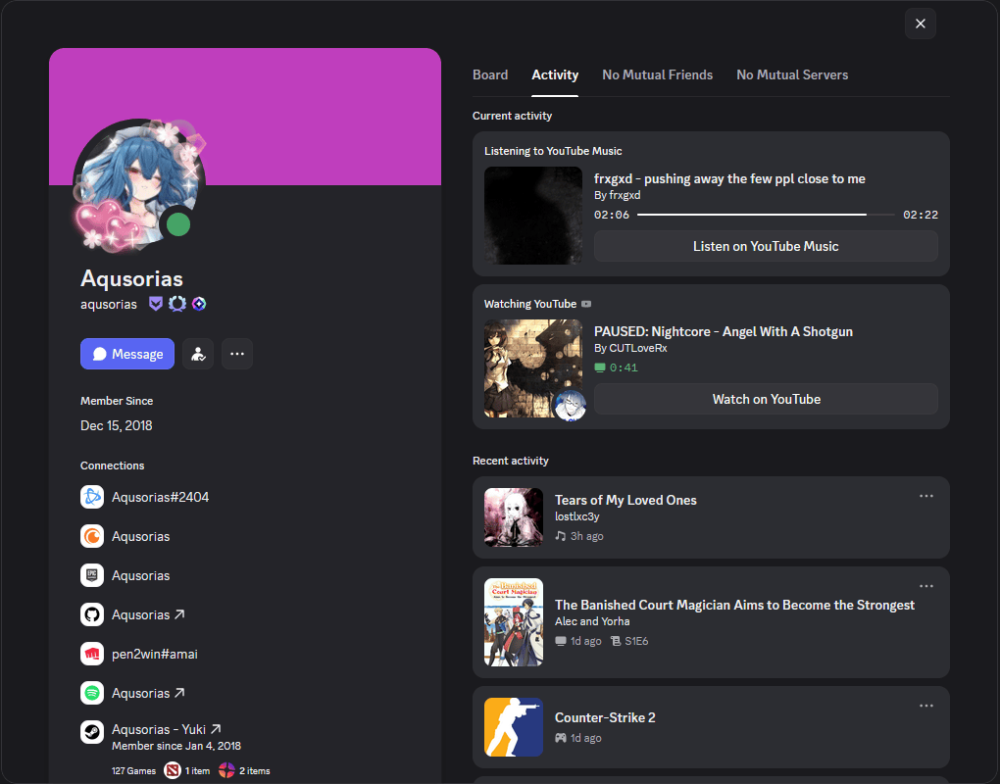
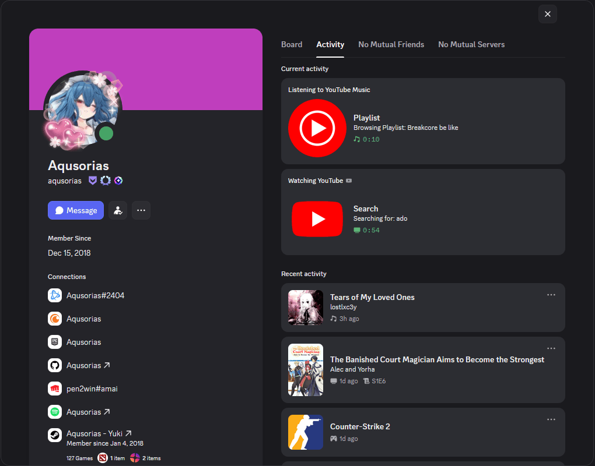
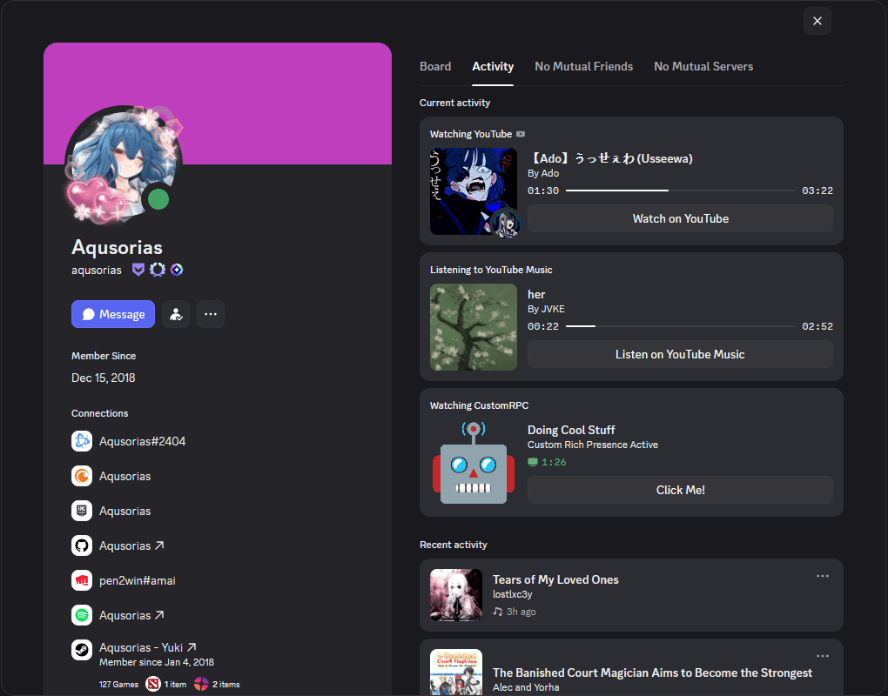

<h1 align="center">Enhanced Discord Rich Presence</h1>

  Display your YouTube & YouTube Music activity directly in Discord with rich, customizable presence information.

  
  

  
  
  

<table>
  <tr>
    <td width="50%" align="center" valign="middle">
      
    </td>
    <td width="50%" valign="top">

### Extension Popup

Compact version of the extension settings popup.  
Designed for quick access without descriptions.

- Fast configuration
- Lots of customizability
- Ideal for everyone

    </td>
  </tr>
</table>

 

<table align="center">
  <tr>
    <td align="center">
       
      Detailed, visually appealing RPCs
    </td>
    <td align="center">
       
      Share your activity beyond just watching
    </td>
    <td align="center">
       
      <strong>YouTube</strong>, <strong>YouTube Music</strong> & <strong>Custom Activity</strong> support
    </td>
  </tr>
</table>

---

## 🛠️ System Requirements

- **Operating System:** Windows 10/11
- **Browser:** Firefox
- **Discord:** Stable, Canary, or PTB

## 🚀 Installation

### Step 1: Download the Native App

1. Go to the [Releases page](../../releases/latest)
2. Download `Enhanced_RPC_Installer_[version].exe`
3. Run the installer and follow the on-screen instructions
   - The installer will:
     - Extract the native app to your system
     - Register it with Firefox for native messaging

### Step 2: Install the Firefox Extension

1. Install the extension from the [Firefox Add-ons store](https://addons.mozilla.org/en-US/firefox/addon/enhanced-discord-rich-presence/)
### Step 3: Verify Installation

1. Open the extension popup from your browser toolbar
2. Confirm you can see the main sections: YouTube, YouTube Music, and Custom Activity
3. Play a YouTube video or YouTube Music track
   - Discord activity should appear near-instantly

> [!NOTE]
> To uninstall the extension, follow these steps:
>
> 1. Open **Settings → Apps → Installed apps** (Windows 11)  
>    or **Control Panel → Programs → Programs and Features** (Windows 10)
> 2. Find **Enhanced Discord RPC (version x.y.z)**
> 3. Select **Uninstall** and complete the removal process
> 4. Open Firefox and [remove the extension](https://support.mozilla.org/en-US/kb/disable-or-remove-add-ons#:~:text=Removing%20extensions,-Click)

### Troubleshooting

| Issue | Solution |
|------|----------|
| "Native app not detected" | Re-run the installer from the Releases page or verify that the native executable is correctly installed |
| "Newer app version available" | A newer version is available on GitHub. You can ignore or mute the notification in the extension popup, but updating is recommended |
| Extension not loading | Update Firefox to the latest version and reinstall the extension |
| Discord presence not showing | Ensure Discord is running, restart it, and confirm that media is actively playing on YouTube or YouTube Music |

## 🔗 Links

- **GitHub Repository**: [Enhanced Discord Rich Presence](../../)
- **Issues & Bug Reports**: [GitHub Issues](../../issues)
- **Feature Requests**: [GitHub Discussions](../../discussions)
- **Firefox Add-ons**: [Firefox Add-ons store](https://addons.mozilla.org/en-US/firefox/addon/enhanced-discord-rich-presence/)

